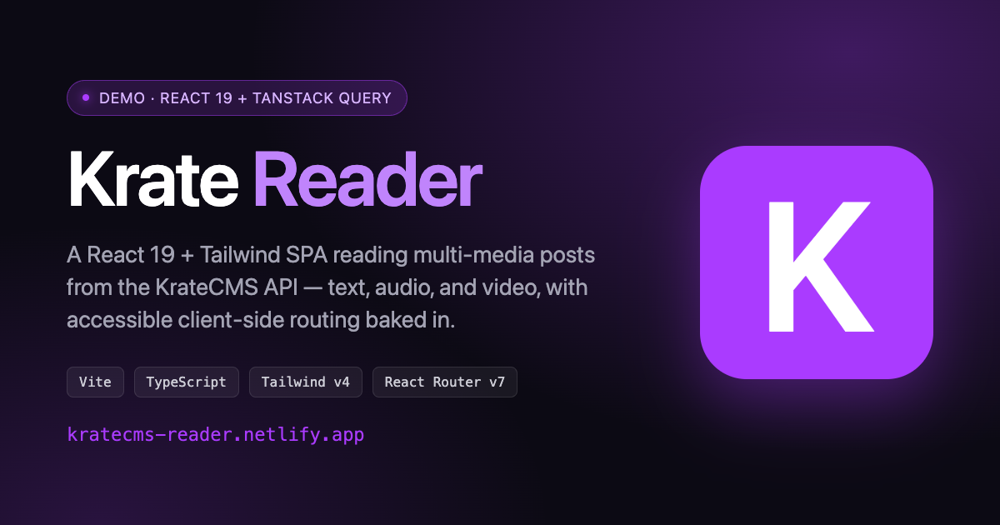

# Krate Reader

A React 19 + TypeScript + Tailwind SPA that reads multi-media posts (text, audio, video) from the [KrateCMS](https://kratecms.com) REST API and serves them as a fast, accessible, deploy-preview-friendly experience on Netlify.

**[Live demo →](https://kratecms-reader.netlify.app)** · [](https://app.netlify.com/sites/kratecms-reader/deploys) · [](LICENSE)



## Why this exists

[KrateCMS](https://kratecms.com) is a Laravel 11 + Livewire multi-tenant CMS I built and run — it ships its own public web frontend and is approaching alpha. I built **a second consumer** in React for three reasons:

1. **Dogfood the API.** A separate frontend stresses the API differently than the first-party Livewire UI does. Building this surfaced eight real enhancement opportunities I filed back upstream as issues with curl repros and Laravel-shaped fixes ([details below](#upstream-issues-filed)) — two are already merged.
2. **Work both sides of the stack.** My background is primarily PHP and content-management work, and I wanted hands-on production React/TypeScript experience in a context I genuinely care about. KrateCMS gave me a real reason to ship across the boundary instead of building a contrived demo: same product, two stacks, same standard of craft.
3. **Have a real React portfolio piece.** Not a tutorial repo — a deployed product, with its own tests, deploy previews, social meta, accessibility wiring, and decisions I can defend.

## Highlights

What's worth looking at if you only have 60 seconds:

- **Accessibility wired through to E2E** — focus moves to the `<h1>` on every route change, filter chips expose `aria-pressed`, pagination exposes `aria-current="page"`, the skip link is reachable on the first Tab. All of it asserted in [Playwright specs](e2e/) (21 total).
- **Slug-based URLs, client-side resolved** — KrateCMS's polymorphic `/posts/{slug}` was a 404 at the time of writing (now partially shipped — see [kratecms#576](https://github.com/jaballer/kratecms/issues/576)). The React app routes `/posts/:slug` and resolves to a post client-side from a cached merged list. Legacy `/posts/:id` URLs `<Navigate replace>` to the canonical slug. Decimal-id detection is guarded by a strict `/^\d+$/` regex — Codex caught that `Number("0x22") === 34` would otherwise misroute, and the same `ctype_digit` discipline now mirrors on the Laravel side of the stack.
- **Best-effort multi-page fetch** — `Promise.allSettled` for pages 2+, so a transient backend hiccup doesn't break the detail page for a post on page 1.
- **Provider-aware media embeds** — YouTube via `youtube-nocookie.com`, SoundCloud via the `w.soundcloud.com/player/?url=…` transform (the raw share URL is blocked by `X-Frame-Options`), forward-compatible `<audio>` rendering ready for an upstream API field that's still in flight.
- **Real CORS strategy that survives prod** — the Vite dev proxy and the [`netlify.toml`](netlify.toml) edge proxy do the same thing on different layers; the React app sees same-origin `/api/*` requests in both dev and prod, no code branches.
- **Honest tradeoff documentation** — the [Decisions & tradeoffs](#decisions--tradeoffs) table below names what I considered and rejected, not just what I picked.

## Built on Netlify

The Netlify-specific work lives in [`netlify.toml`](netlify.toml):

```toml
[build]
  command = "npm run build"
  publish = "dist"

# Proxies /api/* server-side to https://kratecms.com so the browser sees
# same-origin requests (sidesteps the missing-CORS case until the
# upstream config lands in production).
[[redirects]]
  from = "/api/*"
  to   = "https://kratecms.com/api/:splat"
  status = 200
  force  = true

# SPA fallback: client-side routes like /posts/fake-it-till-i-make-it
# return index.html instead of Netlify's 404.
[[redirects]]
  from = "/*"
  to   = "/index.html"
  status = 200

# Vite outputs fingerprinted filenames — safe to cache forever.
[[headers]]
  for = "/assets/*"
  [headers.values]
    Cache-Control = "public, max-age=31536000, immutable"
```

What this gives the project:

- **No CORS branching** between dev and prod — the React app fetches `/api/*` in both environments. The Vite dev proxy and the Netlify edge proxy resolve it on different layers.
- **Deep links work on refresh** — `/posts/hiking-bars` reloads cleanly instead of 404'ing at the CDN.
- **Cache tuned per surface** — `index.html` is `must-revalidate` (new deploys picked up instantly), `/assets/*` are immutable for a year (so the React bundle is served from the edge after first hit).
- **Deploy preview on every PR** — Netlify's GitHub integration spun up a preview environment for [PR #1](https://github.com/jaballer/kratecms-reader/pull/1) automatically, which let me sanity-check the slug routing against real content before merging.

## How to run

```bash
npm install
npm run dev          # http://localhost:5173
```

Vite proxies `/api/v1/*` to `https://kratecms.ddev.site` for local development (configurable in [`vite.config.ts`](vite.config.ts)). For production, the [`netlify.toml`](netlify.toml) edge proxy forwards to `https://kratecms.com`.

## Tests

Playwright E2E suite — 21 specs across 4 files.

```bash
npm run e2e          # headless, against the local dev server
npm run e2e:ui       # Playwright UI mode for debugging
npm run e2e:prod     # smoke-test the deployed Netlify URL
```

The config auto-starts the Vite dev server when running locally — no separate `npm run dev` needed.

| Spec | What it covers |
|---|---|
| [e2e/homepage.spec.ts](e2e/homepage.spec.ts) | List renders, category filter toggles `aria-pressed`, pagination updates `aria-current` |
| [e2e/detail.spec.ts](e2e/detail.spec.ts) | Click-through to `/posts/:slug`, focus moves to H1, iframe `title` attribute, page-1 post still renders on page-2 fetch failure, legacy `/posts/:id` redirect |
| [e2e/errors.spec.ts](e2e/errors.spec.ts) | 404 alert without retry; crafted non-decimal ids (`0x22`, `1e2`, `+34`, `34.0`) don't trigger a redirect |
| [e2e/a11y.spec.ts](e2e/a11y.spec.ts) | First Tab reveals the skip link; landmark count; no console errors on a typical browse session |

## Project structure

```
src/
  api/
    types.ts          Post, Author, pagination types (raw + normalized)
    client.ts         fetch wrapper, ApiError, meta unboxing, multi-page merge
    queries.ts        TanStack Query queryOptions
  components/
    Layout.tsx        Header, footer, <Outlet />, skip link
    PostCard.tsx      Grid card with featured image + meta
    CategoryBadge.tsx
    CategoryFilter.tsx
    Pagination.tsx
    MediaEmbed.tsx    Provider-aware: <audio>, YouTube, SoundCloud, generic iframe
    Spinner.tsx
    ErrorState.tsx
  pages/
    PostListPage.tsx
    PostDetailPage.tsx  Slug → post lookup, legacy-id redirect
  lib/
    cn.ts             clsx + tailwind-merge
    format.ts         Intl date formatting
  App.tsx             Router + QueryClient
  main.tsx
  index.css           Tailwind + design tokens + a11y resets

e2e/                  Playwright specs
netlify.toml          Build, edge proxy, SPA fallback, headers
playwright.config.ts  Test config (localhost + deployed-URL modes)
vite.config.ts        Dev proxy to KrateCMS
```

## Decisions & tradeoffs

| Decision | Why |
|---|---|
| TanStack Query over `Suspense + use()` | Caching, retries, `keepPreviousData`, devtools — all things `use()` would force me to reinvent. |
| React Router v7 data router (`createBrowserRouter`) | The current API; `<Navigate>`, `<ScrollRestoration />`, nested layouts via `<Outlet />` come built-in. |
| Slug URLs (client-side resolution) | KrateCMS detail endpoint is id-only ([kratecms#576](https://github.com/jaballer/kratecms/issues/576)). I fetch the merged list once and resolve `slug → post` in memory. Legacy `/posts/:id` URLs `<Navigate replace>` to the canonical slug. Acceptable at ~18 posts; would move to a server-side slug route at scale. |
| Native `<audio>` for audio posts (forward-compat) | KrateCMS API doesn't expose the file URL yet ([kratecms#581](https://github.com/jaballer/kratecms/issues/581)). The `Post` type and `MediaEmbed` already declare and render the `audio_url` field; once upstream ships it, audio-category posts get a real `<audio>` player with no React-side changes. |
| Client-side category filter | API ignores `?category=` ([kratecms#577](https://github.com/jaballer/kratecms/issues/577)). Acceptable at the current dataset size; flagged in code with a TODO link to the issue. |
| Tailwind v4 `@theme` for design tokens | CSS custom properties become utility classes for free. Light and dark mode share one variable set. |
| Playwright over Vitest + Testing Library | The high-leverage tests for this app are end-to-end (routing, focus, pagination, filter). Vitest would be overkill for the 2-3 pure helpers (`unbox`, `youtubeIdFromUrl`). Would add Vitest if the API client grows. |
| Netlify edge proxy over per-request CORS | The upstream API didn't ship CORS headers initially ([kratecms#575](https://github.com/jaballer/kratecms/issues/575), since partially closed). The proxy makes the browser see same-origin requests in both dev and prod with no code branches. |
| No CSS-in-JS, no UI kit | Showing the work — `cn` helper + Tailwind tokens + native HTML elements where they exist (`<audio>`, `<time>`, `<details>`-style patterns). |

## Accessibility

- Skip link in [Layout.tsx](src/components/Layout.tsx) jumps focus to `<main id="main">`.
- Focus moves to the page `<h1>` on every route change ([PostDetailPage.tsx](src/pages/PostDetailPage.tsx) — `useEffect` + `tabIndex={-1}`). Screen reader users hear the new title immediately.
- `aria-pressed` on filter chips, `aria-current="page"` on pagination, `role="alert"` on errors, `aria-live` on the "X shown" indicator.
- `prefers-reduced-motion` honored globally (CSS reset) and per-component (Tailwind `motion-reduce:` variants).
- Featured images use `loading="lazy"` + meaningful `alt` text from the CMS, with `alt=""` fallback when the field is empty (decorative).
- All embed iframes have a `title` attribute describing the content.

The Playwright suite asserts the focus pattern, the ARIA attributes, the skip-link behavior, and a "no console errors on a typical browse session" baseline.

## Upstream issues filed

A side effect of building a real consumer against an in-progress API: I found seven real bugs in my own CMS and filed each with a curl repro + a Laravel-shaped suggested fix. Cross-stack ownership.

| # | Title | Status |
|---|---|---|
| [kratecms#574](https://github.com/jaballer/kratecms/issues/574) | `meta.*` returned as `[v, v]` arrays instead of scalars | Open — unboxed client-side |
| [kratecms#575](https://github.com/jaballer/kratecms/issues/575) | CORS preflight missing `Access-Control-Allow-Origin` | Partially merged — code shipped, prod env var pending |
| [kratecms#576](https://github.com/jaballer/kratecms/issues/576) | `/posts/{slug}` returns 404; detail is id-only | Partially shipped — `/posts/by-slug/{slug}` alias works in prod; polymorphic route exists locally. Reader currently uses cached-list resolution; could switch to a single-request `by-slug` fetch as a follow-up. |
| [kratecms#577](https://github.com/jaballer/kratecms/issues/577) | Query filters silently ignored | Open — client-side filter |
| [kratecms#578](https://github.com/jaballer/kratecms/issues/578) | SoundCloud `embed_url` is a share URL (blocked by `X-Frame-Options`) | Open — provider transform in [MediaEmbed.tsx](src/components/MediaEmbed.tsx) |
| [kratecms#579](https://github.com/jaballer/kratecms/issues/579) | `author.email` exposed on public response | Open — never rendered in UI |
| [kratecms#580](https://github.com/jaballer/kratecms/issues/580) | Public reads return `Cache-Control: no-cache, private` | Open — TanStack Query covers the gap for now |
| [kratecms#581](https://github.com/jaballer/kratecms/issues/581) | Audio-category posts don't expose the file URL | Open — render path ready in [MediaEmbed.tsx](src/components/MediaEmbed.tsx) |

## How I built this

Built collaboratively with [Claude Code](https://docs.claude.com/en/docs/claude-code/overview) (Anthropic's CLI for Claude). I treated it like a fast pair: it drafted scaffolds, I made the calls on prop API, component boundaries, error UX, focus management, and what to file as upstream issues. The codebase is a real example of AI-assisted senior engineering, which is exactly the workflow modern teams should be comfortable with.

## What's next

- **Switch the slug fetch to the `by-slug` alias** — KrateCMS already exposes `/api/v1/posts/by-slug/{slug}` in production, which would replace the cached-list workaround with a single-request lookup. Holding off until the polymorphic `/posts/{slug}` route ships ([kratecms#576](https://github.com/jaballer/kratecms/issues/576)) so the React side switches once, not twice.
- **Server-side filter + search** — depends on [kratecms#577](https://github.com/jaballer/kratecms/issues/577). The chip UI is ready; just needs a real API behind it.
- **Native audio player** — depends on [kratecms#581](https://github.com/jaballer/kratecms/issues/581). React side is already wired.
- **CI workflow** — `.github/workflows/e2e.yml` running Playwright on PRs would be a natural next step.
- **Visual regression** — the OG card + grid layout could be pinned with Percy or Chromatic-style snapshot diffing.

## License

[MIT](LICENSE).
